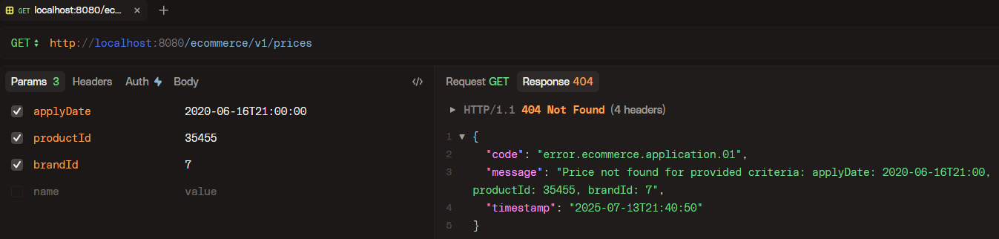
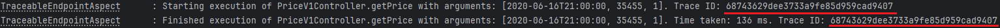
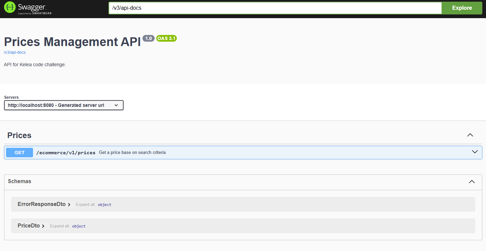

# Kelea Code Review

Este proyecto es una pequeña POC que implementa una solución para hacer búsquedas en una base de datos de precios.

## Estructura principal

Teniendo en cuenta que el aplicativo pudiera escalar en complejidad en el futuro, se ha optado por un enfoque que emplea arquitectura hexagonal + DDD + Clean Code. El esquema básico es el siguiente:

* __application__
    * Lógica de negocio de la aplicación. En este caso, debido a la sencillez del enunciado, esta capa es simplemente un proxy hacia el nivel de infraestructura. Se ha aprovechado para añadir una caché e implementar una casuística que muestre un caso de error controlado del aplicativo.
* __domain__
    * Clases comunes e interfaces para comunicar la capa de aplicación con la de infraestructura.
* __infrastructure__
    * Implementación los puertos de salida del aplicativo (en este caso, una base de datos en memoria H2, como se requería), además de los adaptadores con los mappers entre dominio-entidad.
* __interfaces__
    * Implementación de puertos de entrada al aplicativo (en este caso una API REST), además de los adaptadores con los mappers entre dominio-DTO.

Aunque en arquitectura hexagonal las implementaciones de los puertos tambien pueden estar dentro de un único paquete de infraestructura, por cuestiones de claridad prefiero separar puertos de entrada y de salida en paquetes distintos, que es otro enfoque válido en estas soluciones.

### Excepciones
El aplicativo implementa un modelo de respuesta de errores estandarizado para todo el proyecto, que hace uso de un RestControllerAdvice para manejarlos. Todas las excepciones incorporan un código propio de excepción del aplicativo, un mensaje de error descriptivo, un identificador único por petición y un TimeStamp con la fecha en la que se produjeron, además de devolver el código HTTP adecuado para cada tipo.



### Aspectos
Se ha utilizado Spring AOP para implementar un aspecto que monitoriza la entrada y salida de las llamadas a la API que se expone, así como el tiempo de ejecución de las mismas. También muestra el identifizador de la traza para que puedan hacerse seguimiento de las peticiones.

### Caché
El aplicativo usa Caffeine para implementar una caché a nivel de la capa de aplicación que mejora el rendimiento de las consultas. En el application.yml está la configuración de la misma.

## Testing
El proyecto tiene tests unitarios y de integración que comprueban y cubren el 100% de la implementación y de los escenarios pedidos en el enunciado. La creación de la base de datos y la posterior inserción de datos para las pruebas se ha implementado mediante scripts de Liquibase.

## Métricas
Se ha añadido soporte con Micrometer para generar identificadores de las trazas por petición y que puedan incluirse en los logs con fines de trazabilidad. Se han expuesto los endpoints de metrics y Prometheus para añadir métricas básicas del aplicativo.




## Dependencias

| library                             | version |
|-------------------------------------|---------|
| Java SDK                            | 21+     |
| Spring Boot                         | 3.5.3   |
| Maven                               | 3.9.x+  |

## Instalación y ejecución

Para compilar y ejecutar los tests:

```bash
  mvn clean install
```

Para ejecutar el microservicio:

```bash
  java -jar target\ecommerce-0.0.1-SNAPSHOT.jar
```

## OpenApi

El proyecto tiene OpenAPI configurado. Se puede acceder desde los endpoints:

```
  http://localhost:8080/v3/api-docs
  http://localhost:8080/swagger-ui/index.html
```



## Próximos pasos
* Debido a la poca complejidad de la prueba, no es necesario realizar implementaciones de colas de mensajería (no hay comunicación con componentes externos) ni de circuit breakers (la base de datos está en memoria y es extremadamente simple).


* En el caso de que a futuro se quisieran implementar más mejoras, podría usarse Resilience4j en la capa de aplicación para proteger al aplicativo de fallos en servicios remotos (como podría ser un bróker Kafka).


* Por otro lado, si quisieran extenderse los criterios de búsqueda, podrían implementarse añadidos como queries dinámicas con Spring JPA y Predicates o paginación con Pageables.
También podrían realizarse integraciones con servicios como Grafana para extender la observabilidad del aplicativo.